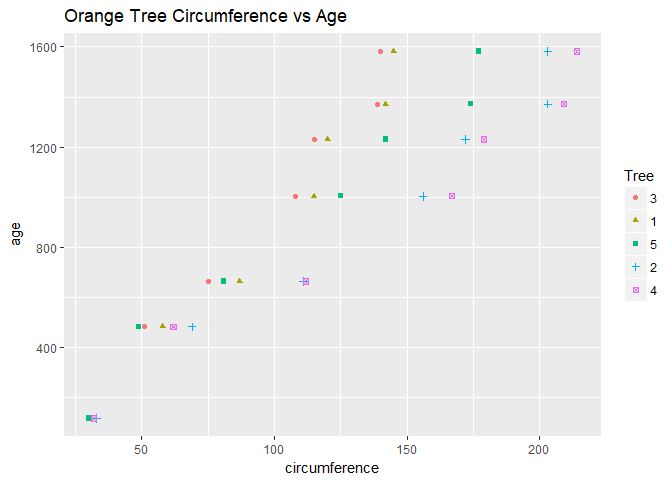
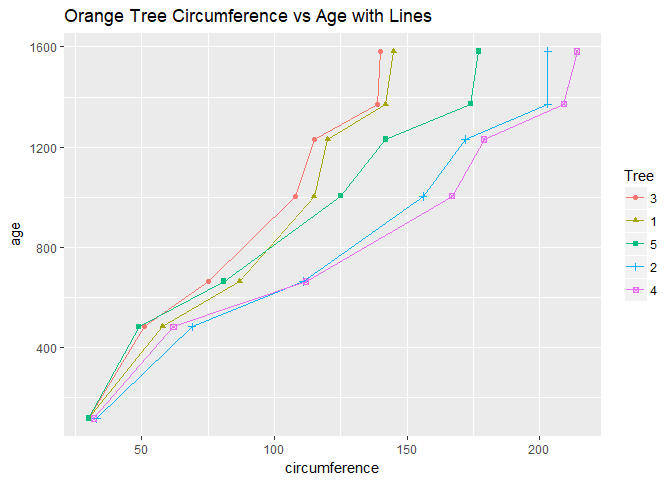
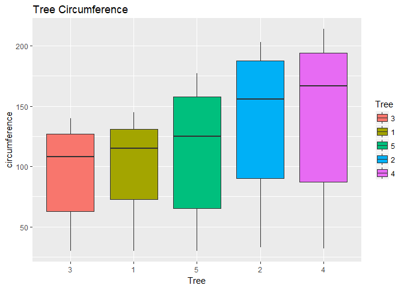
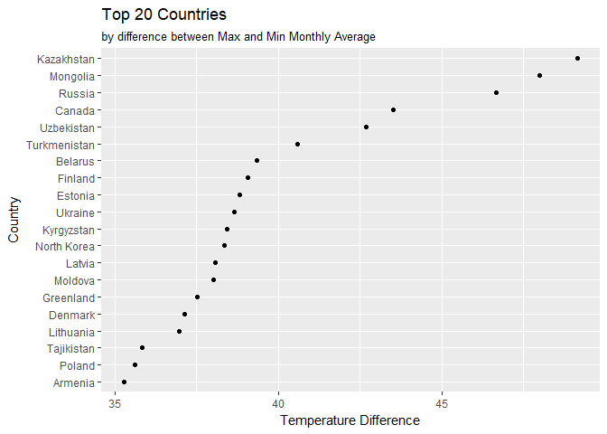
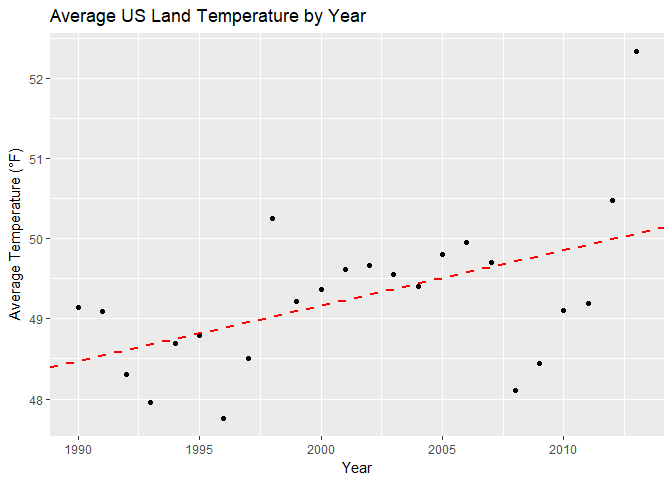

Introduction
------------

This presentation is composed of two main sections. The section titled
"Question 2" analyzes orange tree growth. The "Question 3" section
analyzes temperature trends on a country and city bases. The procedure
to load, cleanse and analyze data will be described in each section.

Libraries
---------

Two R libraries were used to address the requirements for both sections.
"ggplot2" is used for all visualizations. "dplyr" is used to cleanse and
manipulate data.

``` {.r}
source("CS2Libraries.R")
print("Libraries Loaded")
```

    ## [1] "Libraries Loaded"

Question 2
----------

The data set named "Orange" is delivered with the "datasets" R package.
The "Orange" data set includes three columns: Tree, Age and
Circumference. This data is used to calculate the mean and median of the
trunk circumferences for the different trees, plot the tree
circumference agains the age and to produce a box plot to show
circumference data by tree. This data set required no cleansing prior to
analysis.

The code for cleansing and analyzing the "Orange" data set is sourced in
the code chunk below:

``` {.r}
source("CS2Q2Analysis.R", print.eval = FALSE)
print("Question 2 Analysis Complete")
```

    ## [1] "Question 2 Analysis Complete"

The "Orange" data set is loaded into R for analysis.

``` {.r}
data("Orange")
```

### Question 2.a

The mean and median for the entire Orange tree population is calculated.

``` {.r}
cat("The median circumference for all tree measurements is", median(Orange$circumference),".", "The mean circumference for all tree measurements is", mean(Orange$circumference),".")
```

    ## The median circumference for all tree measurements is 115 . The mean circumference for all tree measurements is 115.8571 .

The mean and median circumference of each tree is calculated.

``` {.r}
#TreeCirc <- Orange %>% group_by(Tree) %>% summarise(circmedian=median(circumference), circmean=mean(circumference))
print(TreeCirc)
```

    ## # A tibble: 5 x 3
    ##    Tree circmedian  circmean
    ##   <ord>      <dbl>     <dbl>
    ## 1     3        108  94.00000
    ## 2     1        115  99.57143
    ## 3     5        125 111.14286
    ## 4     2        156 135.28571
    ## 5     4        167 139.28571

### Question 2.b

Two plots are produced to show the relationship between tree
circumference and age. The first plot is a scatter plot mapping the
relationship between tree age and circumference. The data shows tree
circumference increases as each tree ages. The second plot is the
contains lines connecting the data points. Adding lines makes it easier
to see the positive relationship between tree age and circumference.

``` {.r}
ggplot(Orange, aes(x=circumference, y=age, shape=Tree, color=Tree)) +geom_point() +ggtitle("Orange Tree Circumference vs Age")
```



``` {.r}
ggplot(Orange, aes(x=circumference, y=age, shape=Tree, color=Tree)) +geom_point() +geom_line() +ggtitle("Orange Tree Circumference vs Age with Lines")
```



### Question 2.c

A box plot is created to show circumference data by tree.

``` {.r}
ggplot(Orange, aes(x=Tree, y=circumference, fill=Tree)) +geom_boxplot() +ggtitle("Tree Circumference")
```



Question 3
----------

This section utilizes two data sets to analyze historical temperature
data for countries and cities. The two data sets are in CSV format,
stored locally and loaded into R using read.csv for cleansing and
analysis.

``` {.r}
dataloc <- paste(getwd(),"/data/TEMP.csv", sep = "")
print(dataloc)
TempData <- read.csv(dataloc, stringsAsFactors = FALSE, header = TRUE)
dataloc <- paste(getwd(),"/data/CityTemp.csv", sep = "")
print(dataloc)
CityTemp <- read.csv(dataloc, stringsAsFactors = FALSE, header = TRUE)
```

The following chunk executes the data load procecures shown above.

``` {.r}
source("CS2Q3Load.R", print.eval = FALSE)
```

    ## [1] "C:/Users/Sturrock/Documents/SMU Data Science/Doing Data Science/CaseStudy2/data/TEMP.csv"
    ## [1] "C:/Users/Sturrock/Documents/SMU Data Science/Doing Data Science/CaseStudy2/data/CityTemp.csv"

### 3.i

This section utilizes the "TempData" data frame created above to find
the top 20 countries with the maximum difference between the monthly
maximum average and minimum average temperatures since 1900.

A subset of the "TempData" data frame is created to store temperature
data since 1900, and the date column is coerced into date format.

``` {.r}
TempData$First2ofDate <- substr(TempData$Date, 1, 2)
TempData$First2ofDate <- as.integer(TempData$First2ofDate)
GT1899TempData <- subset(TempData, (First2ofDate < 17 | is.na(First2ofDate) == TRUE) & complete.cases(Monthly.AverageTemp)== TRUE)
GT1899TempData$Date <- as.Date(GT1899TempData$Date, "%m/%d/%Y")
```

Next, the maximum and minimum monthly averages by country are calculated
and stored in a new data frame. The difference between the maximum and
minimum is then calculated and stored in a new colum. That data is
sorted and subset to arrive at the top 20 countries by difference
between maximum and minimum monthly average since 1900.

``` {.r}
#Find max and min monthly avg temp by country
MMCTempData <- GT1899TempData %>% group_by(Country) %>% summarise(MaxMonthlyAvg=max(Monthly.AverageTemp), MinMonthlyAvg=min(Monthly.AverageTemp))

#Calculate Difference in Max and Min Average Temp by Country
MMCTempData$Diff <- (MMCTempData$MaxMonthlyAvg - MMCTempData$MinMonthlyAvg)

#Sort by Diff Descending
MMCTempData <- MMCTempData[order(MMCTempData$Diff, decreasing = TRUE),]

#Subset the top 20
MMCTop20 <- MMCTempData[1:20,]
```

The code is executed below.

``` {.r}
source("CS2Q3i.R", print.eval = FALSE)
```

The following scatter plot shows the top 20 countries by difference
between monthly maximum and minimum since 1900.

``` {.r}
ggplot(MMCTop20, aes(x=Diff, y=reorder(Country, Diff))) +geom_point() +labs(x="Temperature Difference", y="Country") +ggtitle("Top 20 Countries", subtitle="by difference between Max and Min Monthly Average")
```



### 3.ii

The "TempData" data frame is next utilized to analyze United States
temperature data. The "TempData" data frame is subset to include only
United States temperature data since 1990, a new column for Year is
created and the monthly average temperature in degrees Celcius is used
to create a new column store monthly average temperature in degrees
Fahrenheit.

``` {.r}
source("CS2Q3ii.R", print.eval = FALSE)
```

    ## The maximum Year over Year Temperature Difference is: 1.86485 This difference occured in 2013 The prior year was 2012

``` {.r}
USTemp <- subset(GT1899TempData, Country == 'United States')

#Create average land temp by year, subset for for dates greater than 1989
USTemp$Year <- as.numeric(format(USTemp$Date, "%Y"))
USTemp <- subset(USTemp, Year > 1989)

#Create (°F) column
USTemp$Monthly.AverageTemp.F <- (USTemp$Monthly.AverageTemp * (9/5) + 32)
```

The second requirement of this question is to produce the mean of the
United States monthly average temperatures by year.

``` {.r}
#Calculate average yearly temperature and create new dataframe
USTempYear <- USTemp %>% group_by(Year) %>% summarise(MeanTempF=mean(Monthly.AverageTemp.F))
```

The result is plotted in a scatter plot. A linear regression line is
added to the scatter plot to clearly show yearly temperature trends over
time.

``` {.r}
#Plot yearly temperature averages and Calculate linear regression for input into ggplot abline function
reg1 <- lm(USTempYear$MeanTempF ~ USTempYear$Year)
ggplot(USTempYear, aes(x=Year, y=MeanTempF, group=1)) +geom_point() +labs(y="Average Temperature (°F)") +geom_abline(intercept = reg1$coefficients[1], slope = reg1$coefficients[2], color = "red", linetype = "dashed", size = 1) +ggtitle("Average US Land Temperature by Year")
```



Finally, year over year temperature differences are calculated and the
greatest year over year difference is identified.

``` {.r}
#Calculate Year Over Year average temparature difference
USTempYearYOY <- USTempYear %>% mutate(YoY = MeanTempF - lag(MeanTempF), PriorYear = lag(Year))
USTempYearYOY <- USTempYearYOY[order(USTempYearYOY$YoY, decreasing = TRUE),]
```

``` {.r}
#Print maximum year over year change with the corresponding years
cat("The maximum Year over Year Temperature Difference is:",USTempYearYOY$YoY[1], "This difference occured in", USTempYearYOY$Year[1], "The prior year was", USTempYearYOY$PriorYear[1])
```

    ## The maximum Year over Year Temperature Difference is: 1.86485 This difference occured in 2013 The prior year was 2012

### 3.iii

The objective of section 3.iii is similar to 3.i. Instead of analyzing
temperature data at the country level. This section uses the "CityTemp"
data frame to find the difference between the maximum and minimum
monthly average temperatures by city. This data is then sorted, the top
20 cities by greatest temperature difference are identified and plotted
on a scatter plot.

``` {.r}
#Standardize dates prior to subsetting data
CityTemp$First2ofDate <- substr(CityTemp$Date, 1, 2)
CityTemp$First2ofDate <- as.integer(CityTemp$First2ofDate)
CityTempGT1899 <- subset(CityTemp, (First2ofDate < 17 | is.na(First2ofDate) == TRUE) & complete.cases(Monthly.AverageTemp)== TRUE)
CityTempGT1899$Date <- as.Date(CityTempGT1899$Date, "%m/%d/%Y")

#Find max and min monthly avg temp by country
CityTempMaxMin <- CityTempGT1899 %>% group_by(Country, City) %>% summarise(MaxMonthlyAvg=max(Monthly.AverageTemp), MinMonthlyAvg=min(Monthly.AverageTemp))

#Calculate Difference in Max and Min Average Temp by Country
CityTempMaxMin$Diff <- (CityTempMaxMin$MaxMonthlyAvg - CityTempMaxMin$MinMonthlyAvg)

#Sort by Diff Descending
CityTempMaxMin <- CityTempMaxMin[order(CityTempMaxMin$Diff, decreasing = TRUE),]

#Subset the top 20 and concatenate City and Country
CityTempTop20 <- CityTempMaxMin[1:20,]
CityTempTop20$CityCountry <- paste(CityTempTop20$City, ", ", CityTempTop20$Country, sep = "")

#Plot the top 20
ggplot(CityTempTop20, aes(x=Diff, y=reorder(CityCountry, Diff))) +geom_point() +labs(x="Temperature Difference", y="City") +ggtitle("Top 20 Cities", subtitle="by difference between Max and Min Monthly Average")
```


### 3.iv

Sections 3.i and 3.iii show similar plot graphs of the Top 20 Countries
and Cities by difference between monthly average maximum and minimum
temperature differences. The greatest difference is the absense of China
from the Country data set. Cities in China occupy nine of the twenty top
cities on the city plot. It is possible China would be the top on the
country plot if included in the country data set.

Additionally, these data sets show the most monthly average temperature
differences can be found on the Asian continent. Approximately half of
the countries and 75% of the cities in the respective top 20 lists are
located in Asia. 
